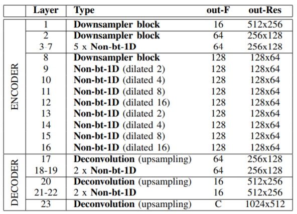
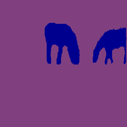

# ERFNET-PyTorch
A PyTorch implementation for [ERFNet](http://www.robesafe.uah.es/personal/eduardo.romera/pdfs/Romera17tits.pdf), for Semantic Segmentation on Pascal VOC.

## Table of Contents:
<!-- Table of contents generated generated by http://tableofcontent.eu -->
- [ERFNET-PyTorch](#erfnet-pytorch)
    - [Project Structure](#project-structure)
    - [Data Preparation](#data-preparation)
    - [Model](#model)
    - [Experiment Configs](#experiment-configs)
    - [Usage](#usage)
    - [Results](#results)
    - [Requirements](#requirements)
    - [Future Work](#future-work)
    - [References](#references)
    - [License](#license)

### Project Structure:
```
├── agents
|  └── erfnet.py # the main training agent 
├── graphs
|  └── models
|  |  └── erfnet.py  # model definition for semantic segmentation
|  |  └── erfnet_imagenet.py  # model definition for imagenet
|  └── losses
|  |  └── loss.py # contains the cross entropy 
├── datasets  # contains all dataloaders for the project
|  └── voc2012.py # dataloader for Pascal Voc dataset
├── data
├── utils # utilities folder containing metrics , config parsing, etc
|  └── assets
├── main.py
├── run.sh
```

### Data Preparation:
We used Pascal Voc 2012 data; to prepare them for training, do the following:
- Visit [this](https://github.com/shelhamer/fcn.berkeleyvision.org/tree/master/data/pascal), download SBD and PASCAL VOC 2012
- Extract them, you will get benchmark_RELEASE and VOCdevkit folders.
- Download [seg11valid.txt](https://github.com/shelhamer/fcn.berkeleyvision.org/blob/master/data/pascal/seg11valid.txt) and add it into VOCdevkit/VOC2012/ImageSets/Segmentation
- Put the benchmark_RELEASE and VOCdevkit folders in a folder named VOC.
- Remove the color map in ground truth annotations by using remove_gt_colormap.py
- Then Check ```./utils/voc_utils.py``` and ```./datasets/voc2012.py``` for iterating on the VOC Dataset.
- Note that all images has been resized to (256x256) for consistency.

### Model:
We are using the same model architecture as given in the paper.



### Experiment Configs:
We used the pretrained model on imagenet for ERFNet encoder and trained the model on Pascal VOC for 70 epochs only. 
```
- Input size: 256x256x3
- Batch size: 64
- Learning rate: 5e-4
- learning_rate_patience: 100
- Betas for Adam: 0.5 and 0.999
- Number of epochs: 70
```
### Usage:
- To run the project, you need to add your configurations into the folder configs/. An example of the configurations that should be passed can be found here
- ```sh run.sh ```
- To run on a GPU, you need to enable cuda in the config file.

### Results:
We only ran a single experiment and got the following results:

| Metric     | Reproduced  |
| ---------- |:-----------:|
| Accuracy   |   88.75%    |
| Mean-IOU   |   55.50%    | 

**Segmented Images after training**:

  
  
  
  


### Requirements:
- Pytorch: 0.4.0
- torchvision: 0.2.1
- tensorboardX: 1.2

Check [requirements.txt](https://github.com/hagerrady13/ERFNet-PyTorch/blob/master/requirements.txt).

### Future Work:
- Train ERFNet with weighted loss

### References:
- PyTorch official implementation: https://github.com/Eromera/erfnet_pytorch 

### License:
This project is licensed under MIT License - see the LICENSE file for details.


